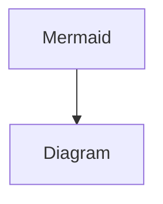

<!-- snapshot metadata
  captured: 2026-03-31
  notion_api_version: 2026-03-11
  page_id: 3340ec74-530b-8046-a9e3-efce5d67c2a1
  notes: S3 image URLs normalized to {{S3_IMAGE_N}} placeholders
-->
# This is an H1
## This is an H2
### This is an H3
#### This is an H4
This is some plain text! And [here is a link in that text](https://ben-tanen.com/)! And [here’s a link to a different Notion page](/23406746c8f64abaa8108e4bc75bf51f?pvs=25)! And [here’s a link to a different Notion page that is part of the CMS DBs](/3320ec74530b8058b146dbf7303304c6?pvs=25)! And [here’s ](https://ben-tanen.com/)[*a link*](https://ben-tanen.com/)[ with ](https://ben-tanen.com/)[**some**](https://ben-tanen.com/)[ styling ](https://ben-tanen.com/)[~~inside~~](https://ben-tanen.com/)[ of it](https://ben-tanen.com/)! And [here’s another link with styling, where using the ](https://ben-tanen.com/)[`inline code block`](https://ben-tanen.com/)[ should mess up the link](https://ben-tanen.com/)! And here’s some text *where *[*the text has italics wrapped around the whole link*](https://ben-tanen.com/)* (plus more outside)*. And [here’s a link with localization stuff for ben-tanen.com](https://ben-tanen.com/projects/2023/12/01/wrapped-sound-town.html)!
This text block is a test of the `{{footnote-1}}`footnote system I’ve implemented`{{end-footnote}}`. Here’s another version where `{{footnote-2}}`the footnote has [a link](https://ben-tanen.com/) inside it`{{end-footnote}}` and `{{footnote-3}}`[another where the footnote body is entirely link](https://ben-tanen.com/)`{{end-footnote}}`!
Here is <span color="red_bg">some</span> <span color="gray_bg">more</span> <span color="orange">text</span> with <span color="purple">coloring</span> <span color="blue">applied</span>!
- This is part of a bulleted list!
- And a second bullet!
	- Here’s a sub bullet!
---
1. This is a numbered list!
2. With second bullet!
	1. Here is a sub-bullet to the second bullet!
		1. And a sub-bullet to that sub-bullet!
3. Now we’re back out at the main level with a third bullet!
---
- [ ] This is a to-do list item!
- [ ] And another one!
---
- This is a list!
1. With different styling mid-list?
- [ ] Here’s a to-do!
---
<details>
<summary>This is the header to a toggle!</summary>
	#### This is an H4 inside the toggle
	Here is some text inside the toggle!
</details>
---
> This is a quote inside a blockquote!<br>Here’s the second line of the blockquote!<br><br>And the third line, with a new-line in between!
<table>
<colgroup>
<col width="239.66666666666666">
<col width="239.66666666666666">
<col width="239.66666666666666">
</colgroup>
<tr>
<td>This is a table!</td>
<td>What happens here?</td>
<td>Column 3 Header!</td>
</tr>
<tr>
<td>Body C1R1 - notice **this has ***some* <span underline="true">formatting</span>!</td>
<td>Body C2R1 - <span color="blue_bg">notice</span> <span color="blue">this</span> <span color="orange_bg">has</span> <span color="brown">colors</span>!</td>
<td>Body C3R1 - notice [this has a link](https://ben-tanen.com/)!</td>
</tr>
<tr>
<td>Body C1R2</td>
<td>Body C2R2</td>
<td>Body C3R2</td>
</tr>
</table>
This text is a full empty block below the mixed formatted list above. How does the empty block come through?? Also <span discussion-urls="discussion://3340ec74-530b-80d2-a520-001c5ae66a2d">how does an editorial comment appear</span>? Below this, there is an embedded tweet!
<unknown url="https://www.notion.so/3340ec74530b8046a9e3efce5d67c2a1#3340ec74530b80e79aeaefe540aa8dc1" alt="tweet"/>
<callout icon="🔍" color="gray_bg">
	This is a callout box with a magnifying glass as the emoji!
	Here is a second line to that callout box [with a link](https://ben-tanen.com/)!
	
</callout>
<callout icon="🎩" color="gray_bg">
	This is a different callout box with a hat emoji!
</callout>
Here is an equation: $`x = y_0 + y_1`$
```plain text
This is a plain text code snippet!
```
```plain text

{# this is a test of Jekyll/Jinja/Liquid formatting! #}
Hello!


```
```plain text
<h1>This is an H1 as rendered in HTML!</h1>
<link rel="stylesheet" href="/projects/trump-timeline/css/main.style.css">
<script src="/projects/trump-timeline/js/viz.js"></script>
```
```python
# This is a Python code snippet! (as a comment)
5 + 5
```


]({{S3_IMAGE_4}})

<columns>
	<column>
		### Column One (H1)
		This is a two column set up!
		
	</column>
	<column>
		### Column Two (H3)
		Here’s the second column!
		
	</column>
</columns>
<page url="https://www.notion.so/3340ec74530b8070990ef2646f1e64f5">Notion Markdown API Test (Sub-Page)</page>
<columns>
	<column>
		<unknown url="https://www.notion.so/3340ec74530b8046a9e3efce5d67c2a1#3340ec74530b801a853adb25182f227d" alt="tweet"/>
		This column contains one version of the tweet!
		<empty-block/>
	</column>
	<column>
		<unknown url="https://www.notion.so/3340ec74530b8046a9e3efce5d67c2a1#3340ec74530b8085bce3dcf4fff582a7" alt="tweet"/>
		This column contains another version of the tweet (with a caption)!
	</column>
	<column>
		<unknown url="https://www.notion.so/3340ec74530b8046a9e3efce5d67c2a1#3340ec74530b80d9b61df8ccec3511f9" alt="tweet"/>
		This is like the first column!
	</column>
</columns>

<unknown url="https://www.notion.so/3340ec74530b8046a9e3efce5d67c2a1#3340ec74530b80c6ba9ff5de500473fd" alt="alias"/>
<file src="file://%7B%22source%22%3A%22attachment%3Ae6862017-2125-45ff-b977-61dd540e7275%3Atest-file.txt%22%2C%22permissionRecord%22%3A%7B%22table%22%3A%22block%22%2C%22id%22%3A%223340ec74-530b-80b4-9bf0-daca2367f18e%22%2C%22spaceId%22%3A%22c0f8a935-ec47-4956-a269-d63bcada25b8%22%7D%7D"></file>
<database url="https://www.notion.so/3340ec74530b8043b36bc0a53bb2c5bc" inline="true" data-source-url="collection://3340ec74-530b-80aa-b17e-000bda38c76f">This is a test database!</database>
<synced_block url="https://www.notion.so/3340ec74530b8046a9e3efce5d67c2a1#3340ec74530b80cd88b8fb738fe83ccd">
	This is a sync block! It’ll show up with the other sync block below!
</synced_block>
The text above and below this are in sync blocks!
<synced_block_reference url="https://www.notion.so/3340ec74530b8046a9e3efce5d67c2a1#3340ec74530b80cd88b8fb738fe83ccd">
	This is a sync block! It’ll show up with the other sync block below!
</synced_block_reference>